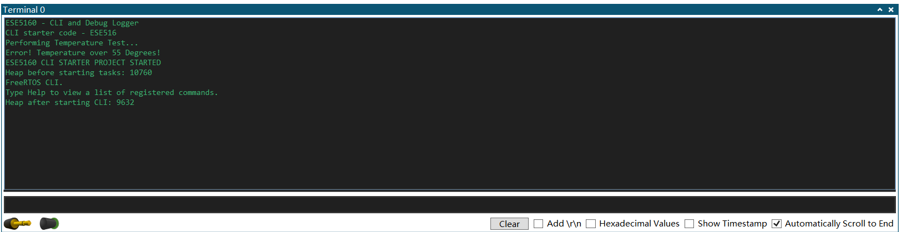
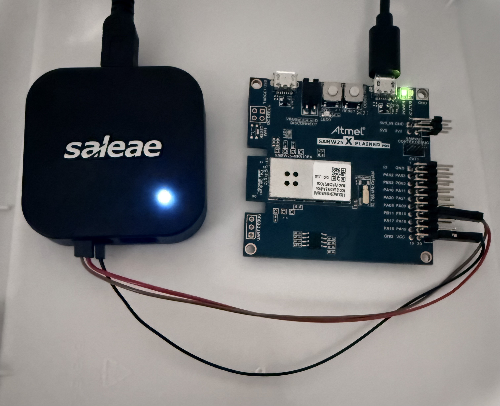
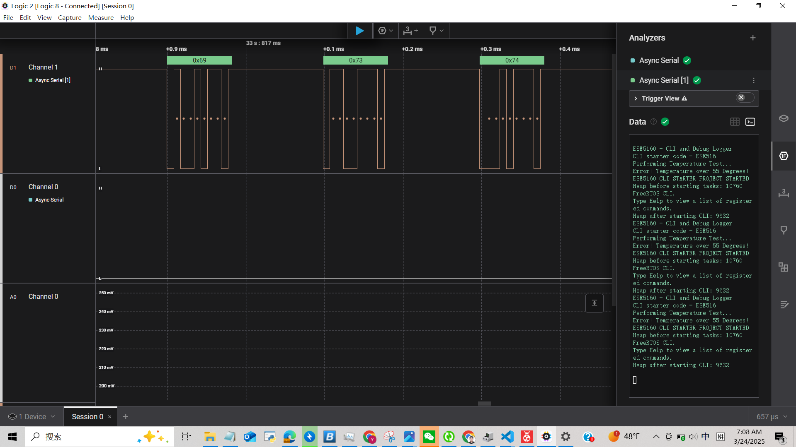
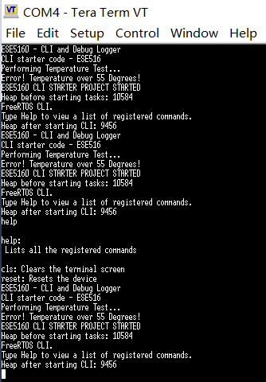
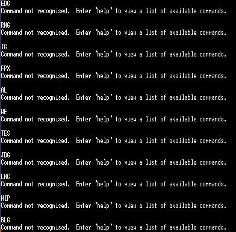

# a07g-exploring-the-CLI

* **Team Number: 18**
* **Team Name: DualCore**
* **Team Members: Peng Su, Yuanchao Zhang**
* **GitHub Repository URL: https://github.com/ese5160/a00g-devices-designs-diagrams-s25-dualcore**
* **Description of hardware (embedded hardware, laptop, etc): (1)Apple M3 Pro, macOS Sonoma (2) Apple M1 Pro - Macbook**

## Part 1. Software Architecture

## (1) : Update the requirements of  HRS & SRS  based on the latest modifications

## Hardware Requirements Specification (HRS)

#### HRS 01 – Microcontroller & PCB Base

The project shall be based on a custom PCB integrating a suitable microcontroller (SAM W25). This PCB must provide:

- General-purpose I/O for motor control and sensor data acquisition.
- At least one communication interface (e.g., UART/SPI/I²C) for the LCD screen.
- Wireless connectivity (Wi-Fi/Bluetooth) for smartphone control, or headers for an external module.

#### HRS 02 – Sensors

The system shall incorporate:

- A **Temperature-Humidity Sensor** (e.g., DHTxx/SHTxx) to measure ambient conditions.
- An **Air Quality Sensor** (e.g., MQ-series, CCS811, or similar) capable of detecting smoke or poor air quality.

All sensors must operate under the expected environmental conditions (e.g., indoor ranges of temperature and humidity) and provide reliable, stable readings.

#### HRS 03 – Motor Driver & Window Actuator

A motor driver circuit (integrated on the custom PCB or via a module) shall deliver the necessary current/voltage to a DC or Continuous Rotation Servo that adjusts the window’s opening angle. This includes:

- Support for PWM or position feedback control when we use Continuous Rotation Servo.
- Overcurrent or thermal protection mechanisms.
- Secure mechanical coupling to the window’s frame or rod.

#### HRS 04 – PDLC Film Power and Control

The PCB shall feature a step-up converter to approximately 48 V DC, plus a DC-to-AC conversion stage, enabling segmented control of the PDLC film for time display:

- Each 7-segment “digit” on the glass must be individually switchable.
- The system shall refresh the displayed time at a minimum of once per minute (using the onboard RTC).
- Safe isolation and protective measures against high-voltage lines are required.

#### HRS 05 – Switch Reed Integration

The system shall incorporate a reed switch to ensure precise detection of the window’s fully closed state. This includes:

- Interrupt-based or polling-based detection mechanism integrated with the microcontroller.
- Automatic stopping of the servo motor when the closed position is detected.
- Reliable and durable placement to avoid false triggers or misalignment over time.

#### HRS 06 – Steel Flat-Edge Sliding Window Roller Assembly

- The system shall include a steel flat-edge sliding window roller assembly to ensure smooth and fluent movement during window opening and closing. This includes:
- High-durability rollers capable of supporting the window's weight.
- Minimal friction design for seamless motion.
- Secure mounting and alignment to prevent jamming or misalignment.

#### HRS 07 – Housing & Mounting

All PCB components must fit within the acrylic window frame enclosure to protect electronics. Additionally:

- Mounting points on the PCB for screws or standoffs to secure it in place.
- The LCD shall be flush-mounted or otherwise integrated into the frame for user viewing.
- Proper ventilation or heat dissipation strategies for voltage regulators and motor drivers.

#### HRS 08 – Safety & Protection

The hardware design shall include protection features such as:

- Overvoltage/overcurrent safeguards on motor driver and PDLC driver stages.
- Reverse-polarity protection or fuses as needed.
- Adequate insulation for high-voltage lines (48 V AC) powering the PDLC film.

## Software Requirements Specification (SRS)

**SRS 01 - Window and Environment Data Retrieval:**

The system shall enable users to access real-time window status (open/close/angle) and environmental data (temperature, humidity, air quality) via a smartphone app.

**SRS 02 - Window Time Adjustment:**

The system shall allow users to modify automatic window operating times (e.g., morning open, evening close) through the app.

**SRS 03 - Manual Window Opening and Closing:**

Node-red Dashboard shall provide a Virtual Button to "Open Window" and "Close Window" or angle adjustment.

**SRS 04 - Manual Angle Adjustment for Manual Window Control:**

Node-red Dashboard shall provide a input function for Angle Adjustment.

**SRS 05 - Automated Window Opening by Time:**

Users shall be able to set specific times for automatic window opening in the app.

**SRS 06 - Automated Window Opening by Smoke:**

If the air quality sensor detects smoke or poor air quality, the system shall immediately open the window for ventilation (highest priority).

**SRS 07 - Automated Window Closing by Time:**

Users shall be able to program specific times for automatic window closure in the app.

**SRS 08 - Automated Window Closing by Rain:**

When rain or high humidity is detected, the system shall close the window to prevent water from entering. This has a lower priority than smoke detection but higher than standard scheduling.

**SRS 09 - PDLC Film Time and Weather Display：**

Using PDLC film segments on the glass, the system shall display the current time and weather in a 7-segment style (HH: MM), driven by an internal or external RTC.

**SRS 10 - Voice System / Spoken Alerts:**

Node-red Dashboard shall support a Virtual Voice Module to announce time, environmental alerts (smoke/rain), or user notifications.

**SRS 11 - Window Opening / Closing Constraints:**

The system shall prevent excessive opening or closing if the window is already fully open or closed, avoiding redundant motor actions.

## (2) : A block diagram outlining the different tasks (A07G_BlockDiagram.svg):

## (3) : Submit flowcharts or state machine diagrams:

### **Servo Task** 

- **Initial State**: Starts in `Servo_init_state`.
- If the **servo switch is set**, it transitions to `Motor_forward_rotation`.
- After receiving a **message from the sensor task**, it may return to the initial state or move to `Motor_reverse_rotation`.
- The system toggles between **forward** and **reverse rotation** based on the **servo switch** and **sensor messages**.

---

### **Button x2 Task**

- Starts from the initial state and transitions to `Button_ON` when triggered.
- On **window movement**, it switches to `Button_OFF`.
- Each window movement toggles the state back and forth between `Button_ON` and `Button_OFF`.

---

### **Temperature-Humidity Sensor Task**

- Begins in `TH_Sensor_OFF`.
- When **detection time has passed**, it performs **sensor detection** and transitions to `TH_Sensor_ON`.
- The state loops based on detection timing.

---

### **Relay x4 Task**

- Starts in `Relay_ON` state.
- When **ON time has passed**, it transitions to `Relay_OFF`.
- When **OFF time has passed**, it returns to `Relay_ON`.
- This task toggles states periodically based on ON/OFF timing intervals.

---

### **Air Quality Sensor Task**

- Starts in `AQ_Sensor_OFF`.
- After **detection time has passed**, performs **sensor detection**, and moves to `AQ_Sensor_ON`.
- Loops between the ON and OFF states based on timing and detection.

---

## Part 2. Understanding the Starter Code

**(1) `InitializeSerialConsole()`** sets up the UART interface by initializing circular buffers (**`cbufRx`** for received data and **`cbufTx`** for transmitted data), configuring the USART peripheral, registering callbacks, setting the interrupt priority, and starting an asynchronous read operation. **`cbufRx`** and **`cbufTx`** are **circular buffers**, a fixed-size data structure that efficiently manages streaming data using a head and tail pointer, preventing data loss and reducing CPU overhead in serial communication.

**(2) `cbufRx` and `cbufTx`** are initialized in `InitializeSerialConsole()` using `circular_buf_init()`, which sets up circular buffers for receiving and transmitting UART data using `rxCharacterBuffer` and `txCharacterBuffer`, each **512 bytes** in size. These buffers manage UART communication efficiently by storing incoming and outgoing characters. The data type **`cbuf_handle_t`** and functions like `circular_buf_init()` and `circular_buf_get()` are likely defined in a separate C file, **`circular_buffer.c`**, with corresponding declarations in a header file like **`circular_buffer.h`**.

**(3) The received (**RX**) and transmitted (**TX**) characters** are stored in the character arrays **`rxCharacterBuffer`** (512 bytes) and **`txCharacterBuffer`** (512 bytes), respectively. These buffers temporarily hold UART data before being processed. While **`cbufRx`** and **`cbufTx`** are circular buffer structures, they internally manage data storage using **`rxCharacterBuffer`** and **`txCharacterBuffer`**, ensuring efficient handling of streaming data.

**(4)** The **UART character received** and **UART character sent** interrupts are handled in the callback functions **`usart_read_callback()`** and **`usart_write_callback()`**, respectively. These functions are registered using **`usart_register_callback()`** inside **`configure_usart_callbacks()`**, ensuring they are triggered when a character is received or transmitted. The interrupts are then enabled using **`usart_enable_callback()`**, allowing asynchronous UART communication.

**(5)** The callback function **`usart_read_callback()`** is triggered when a character is **received (RX)**, while **`usart_write_callback()`** is called when a character has been **sent (TX)**. These callbacks are registered inside **`configure_usart_callbacks()`**, linking them to the USART interrupt system. This setup ensures efficient handling of UART communication by automatically responding to character transmission and reception events.

**(6)** In **`usart_read_callback()`**, when a character is **received (RX)**, it is added to the **`cbufRx`** circular buffer, allowing the system to store incoming UART data efficiently. Similarly, in **`usart_write_callback()`**, when a character has been **sent (TX)**, the next character is retrieved from **`cbufTx`** and transmitted via **`usart_write_buffer_job()`**, ensuring continuous data transmission. These callbacks manage UART communication asynchronously by using **`cbufRx`** and **`cbufTx`** to buffer received and transmitted characters, preventing data loss and reducing CPU overhead.

**(7) UART Receive Flowchart:**

**(8) UART Transmission Flowchart:**

**(9)** The function **`StartTasks()`** initializes system tasks and prints the available heap memory before and after task creation. It starts the **Command Line Interface (CLI) task** using **`xTaskCreate(vCommandConsoleTask, "CLI_TASK", CLI_TASK_SIZE, NULL, CLI_PRIORITY, &cliTaskHandle)`**. If the task creation fails, an error message is printed. Based on the provided code, only **one thread (CLI task)** is explicitly started in this function.

## Part 3. Debug Logger Module

**Link of Debug Logger Module in Github Repository (A07G Debug Logger Module):**

https://github.com/ese5160/final-project-a07g-a14g-t18-dualcore/tree/main/A07G%20Debug%20Logger%20Module

**Output of Debug Logger Module (A07G_DebugLogger_Output.png):**

## Part 4. Wiretap the convo!

## 1. Submit Our Answers to Github Repository:

**(1)** The **UART communication** between the **SAMW25** and **EDBG IC** occurs on **SERCOM4**. From `SerialConsole.c`, the **TX** (SAMW25 → EDBG) is mapped to `PB10`, and **RX** (EDBG → SAMW25) is mapped to `PB11`. To capture data using the Saleae Logic 8, attach the logic analyzer as follows:

- **TX (SAMW25 → EDBG)**: `PB10` → `Channel 0`
- **RX (EDBG → SAMW25)**: `PB11` → `Channel 1`
- **GND**: Connect to board ground.

**Pin Mapping**

| **Signal** | **SAMW25 Pin** | **Logic Analyzer Channel** |
| :--------------- | :------------------- | :------------------------------- |
| UART TX          | PB10                 | CH0                              |
| UART RX          | PB11                 | CH1                              |
| GND              | GND                  | GND                              |

**(2) Best connection points:**

- **Test pads:** heck Altium design
- **Debug header:** J200 or similar
- **Direct pin soldering:** last resort

**(3) Critical Settings for the Logic Analyzer**

- **Baud Rate:** `115200`
- **Data Bits:** `8`
- **Parity:** `None`
- **Stop Bits:** `1`
- **Inverted Signal:** `No`
- **Triggering:** "Start Capture on UART Activity" (Edge trigger on TX)

## 2. Photo of Our Hardware Connections (A07G_Logic8_Hardware.png):

## 3. Screenshot of the Decoded Message (A07G_Logic8_DecodedMessage.png):

## 4. A Small Capture File of a Wiretapped Conversation (Logic8_DecodedMessage.sal):

https://github.com/ese5160/final-project-a07g-a14g-t18-dualcore/blob/main/Logic8_DecodedMessage.sal

## Part5: Complete the CLI

**Link of Completed CLI Codebase in Github Repository (A07G Completed CLI):**

https://github.com/ese5160/final-project-a07g-a14g-t18-dualcore/tree/main/A07G%20Completed%20CLI

**Screenshot of Completed CLI Codebase:**

## Part6: Added CLI Commands:

https://github.com/ese5160/final-project-a07g-a14g-t18-dualcore/blob/main/A07G_Part6.mp4

https://drive.google.com/file/d/16XTh9HimEZRzcR5HKSWC8RlaIymCl6Ff/view?usp=sharing
